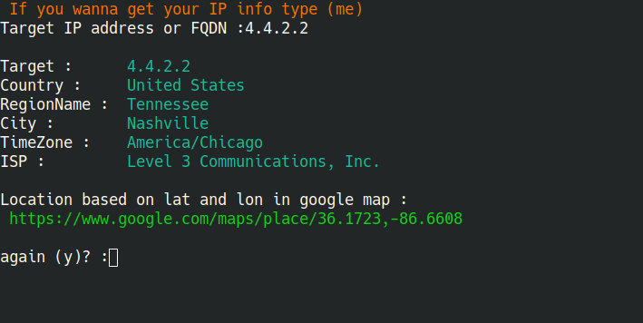

# IP Information
- Get ip information :
- [x] Country
- [x] Region Name
- [x] City
- [x] Time Zone
- [x] ISP
- [x] Location link based on `lat and lon` in `google map`
# Note
- If you wanna get your ip information type (`me`)
# ScreenShot
